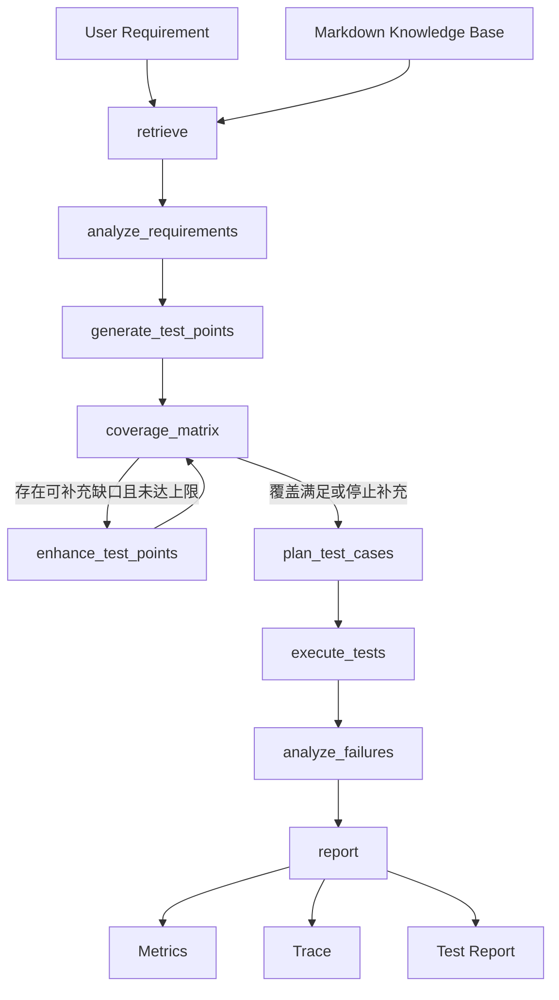

# Quality Agent Test Automation

面向质量效能场景的测试智能化 AI Agent。项目使用 LangGraph 编排需求检索、结构化需求拆解、分层测试点生成、覆盖矩阵分析、缺口定向补充、受约束测试执行、失败分析和报告输出，并保留兼容旧流程及只读 Tool Calling 实验模块。

> 推荐入口是 V2：`POST /agent/v2/run`。旧版 `/agent/run` 仅用于兼容和对照。

## 核心能力

- **结构化测试设计**：使用 `RequirementRule -> TestPoint -> CoverageMatrix -> TestCaseSpec` 数据契约，使需求、测试点、覆盖证据和用例可以追踪。
- **三类覆盖矩阵**：分别计算需求、参数和风险覆盖率，不用单一关键词百分比代替完整覆盖分析。
- **定向补充**：根据具体 `CoverageGap.target_id` 补充测试点，最多两轮；无覆盖提升时停止。
- **API 模型与规则兜底**：`api` 模式优先调用 OpenAI 兼容 API；调用、解析或 Schema 校验失败时进入确定性规则链路。`rule` 模式完全离线。
- **Harness 约束**：Capability Registry、结构化动作、固定断言操作符、请求预算、路径和方法白名单共同限制可执行范围。
- **可观测性**：每次 V2 运行生成独立 `run_id`，并输出 Report、Metrics 和 Trace。
- **Web 控制台**：React/Vite 前端可以运行 V2、切换 API/规则模式，并查看报告、指标、覆盖矩阵和 Trace。
- **评测与回归**：包含 pytest、Test Design Eval、RAG Eval、Structured Output Eval 和 Agent Performance Eval。

## 技术栈

- Backend：Python、FastAPI、Pydantic、requests
- Agent：LangGraph、OpenAI-Compatible API、Tool Calling / Function Calling
- RAG：本地 Markdown 知识库、轻量 Top-K 关键词/字符重合检索
- Testing：pytest、Mock API、结构化断言
- Frontend：React 19、Vite 8、ESLint

## V2 工作流



```text
retrieve
  -> analyze_requirements
  -> generate_test_points
  -> coverage_matrix
       -> enhance_test_points -> coverage_matrix（最多 2 轮）
  -> plan_test_cases
  -> execute_tests
  -> analyze_failures
  -> report
```

### 需求与测试点

`app/tools/requirement_analyzer.py` 先将原始需求拆为 `RequirementRule[]`，记录业务类型、触发条件、前置状态、动作、预期结果、参数和风险。`app/tools/test_point_generator.py` 再生成分层 `TestPoint[]`。

一级测试维度包括：`functional_behavior`、`input_parameter`、`state_flow`、`resource_dependency`、`data_quality`、`reliability`、`security_permission`。它们表示测试关注方向，不代表每条需求必须机械覆盖全部七类。

测试点通过 `requirement_ids`、`parameter_names`、`parameter_checks` 和 `risk_tags` 建立追踪关系。

### 覆盖矩阵

- **Requirement Coverage**：每条需求规则是否至少被一个测试点引用。
- **Parameter Coverage**：字段是否覆盖 `normal`、`empty`、`invalid`、`boundary`、`constraint` 和适用时的 `combination`。
- **Risk Coverage**：状态迁移、幂等性、资源释放、失败回滚、重复扣款、数据一致性等已声明风险是否被覆盖。

```text
结构化关联（confidence=1.0）
  -> 关键词补充（confidence=0.65）
  -> API 语义判断（默认 confidence>=0.8）
  -> 保留未解决缺口
```

语义判断只能引用已有目标 ID 和测试点 ID；低置信度、虚构引用或 API 失败不会提高覆盖率。执行能力缺口也不会通过增加测试点被掩盖。

## Harness

`app/harness/capability_registry.py` 当前注册 8 个本地 Mock 操作：

| 操作 | 用途 |
| --- | --- |
| `reset_mock_data` | 重置进程内 Mock 数据 |
| `create_order` | 创建订单 |
| `cancel_order` | 取消订单 |
| `timeout_cancel_order` | 超时取消订单 |
| `get_order` | 查询订单 |
| `list_user_orders` | 查询用户订单 |
| `get_driver` | 查询司机 |
| `pay_order` | 支付订单 |

当前约束：

- 只允许 `/mock/*` 路径及 GET/POST 方法，禁止绝对 URL 和未注册操作。
- 每条用例最多 12 个请求，默认 HTTP 超时为 5 秒。
- 第一条 setup 动作必须重置 Mock 数据，操作必须与测试点业务类型匹配。
- 执行器使用显式分发表和固定断言操作符，不使用 `eval` 或 Shell 执行模型内容。
- Security、Concurrency、Network Fault、Performance 等未实现能力会标记为不可执行。

## Mock Business API

| Method | Path | Description |
| --- | --- | --- |
| POST | `/mock/reset` | 重置 Mock 数据 |
| POST | `/mock/order/create` | 创建订单 |
| POST | `/mock/order/cancel` | 取消订单 |
| POST | `/mock/order/timeout_cancel` | 超时取消订单 |
| GET | `/mock/order/{order_id}` | 查询订单 |
| GET | `/mock/orders/user/{user_id}` | 查询用户订单 |
| GET | `/mock/driver/{driver_id}` | 查询司机 |
| POST | `/mock/payment/pay` | 支付订单 |

Mock 数据保存在进程内字典中，只用于学习、演示和自动化回归。

## Agent API

| Method | Path | Description |
| --- | --- | --- |
| GET | `/` | 服务健康检查 |
| POST | `/agent/v2/run` | 运行完整 V2 流程 |
| GET | `/agent/v2/trace` | 读取最近一次 V2 Trace |
| GET | `/agent/v2/metrics` | 读取最近一次 V2 Metrics |
| GET | `/agent/v2/report` | 读取最近一次 V2 Report |
| POST | `/agent/run` | 运行兼容 V1 流程 |
| GET | `/agent/trace` | 读取最近一次 V1 Trace |
| GET | `/agent/metrics` | 读取最近一次 V1 Metrics |
| GET | `/agent/report` | 读取最近一次 V1 Report |

V2 请求示例：

```json
{
  "requirement": "重复支付应返回 REPEAT_PAYMENT，并保持订单支付状态一致",
  "model_mode": "api"
}
```

- `api`：优先调用配置的模型 API，失败时规则兜底。
- `rule`：不调用模型，用于离线演示和确定性回归。

## Tool Calling 实验模块

`app/tool_agent/` 手写实现了 OpenAI 兼容 Tool Calling 循环，提供 `get_metrics`、`get_trace`、`get_report` 三个只读工具。它支持一轮多个 `tool_calls`、`tool_call_id` 回填、工具注册与最多五轮循环。

目前它没有接入 FastAPI 或前端，主要通过 `demos/tool_calling_demo.py` 学习和验证模型的动态工具选择；它不会修改测试运行状态。

## 输出与状态

V2 本地运行会生成：

```text
app/outputs/v2_test_report.md
app/outputs/v2_metrics_report.json
app/outputs/v2_execution_trace.json
```

每次 V2 运行使用独立 `run_id`，同时作为 LangGraph `thread_id`。当前 checkpointer 是 `InMemorySaver`，只在单进程生命周期内有效；服务重启后不会保留 checkpoint。输出目录被 Git 忽略，并且只保存最近一次运行结果。

Metrics 包含规则、测试点和用例数量，通过/失败数、通过率、三类覆盖率、剩余缺口、不可执行测试点、补充次数、各阶段来源、降级次数、失败用例 ID 和 Bug 数量。当前指标会记录降级来源与次数，但不会持久化每次模型异常的完整文本。

## 实测结果

以下结果于 2026-09-22 在本项目环境中重新执行获得。它们是当前数据集与环境的回归结果，不代表生产准确率或所有业务质量。

### Repository Tests

```text
140 passed, 1 warning in 2.39s
```

warning 来自 Starlette `TestClient` 对 AnyIO 旧别名的弃用提示。

### Test Design Eval

规则模式黄金集包含订单取消、支付、订单创建 3 个场景：

| Metric | Result |
| --- | ---: |
| Business Classification Accuracy | 100.0% |
| Average Rule Recall Rate | 100.0% |
| Rule -> Test Point Rate | 100.0% |
| Average Layer Coverage Rate | 94.44% |
| Invalid Reference Count | 0 |
| Non-executable Test Point Count | 0 |

订单创建场景的 Layer Coverage 为 83.33%，暴露 `data_quality` 缺口；该结果保留为真实 Bad Case。

### RAG Eval

| Metric | Result |
| --- | ---: |
| Total Questions | 20 |
| Answerable Questions | 10 |
| Expected Source Top-K Hits | 10 / 10 |
| Unanswerable Questions | 10 |
| Correct Rejections | 0 / 10 |
| Citation Source Validation | 20 / 20 |

轻量 RAG 当前会为知识库外问题强制召回，因此不能描述为“RAG 准确率 100%”。

### Agent Performance Eval

本次 10 次 V1 Agent 评测全部完成：平均 7.9016 秒，P50 7.7965 秒，P95 8.5169 秒。测试期间模型 API 连接失败，流程使用规则兜底，因此这组数字不是在线模型推理性能。

### Structured Output 历史报告

`reports/structured_output_eval.json` 是历史 30 次 API 调用记录：23 次获得并通过 JSON/Pydantic 校验，7 次因 API 402 Insufficient Balance 未取得模型输出。API 基础设施失败与结构化输出格式失败必须分开理解，不能直接把 `23/30` 当作模型格式准确率。

### V2 保存样例

最近验证的重复支付规则模式运行生成 2 条规则、7 个测试点和 7 个测试用例，7/7 通过，需求/参数/风险覆盖率均为 100%。这只代表该样例运行，不代表项目整体准确率 100%。

## 项目结构

```text
quality-agent/
|-- app/
|   |-- agent_graph.py          # Legacy V1
|   |-- agent_graph_v2.py       # V2 LangGraph
|   |-- api_server.py           # FastAPI endpoints
|   |-- mock_business_api.py    # In-memory Mock API
|   |-- data/                   # Markdown knowledge base
|   |-- models/                 # Structured contracts
|   |-- tools/                  # Generation, coverage, reports
|   |-- harness/                # Capability registry, planner, executor
|   `-- tool_agent/             # Read-only Tool Calling experiment
|-- demos/
|-- docs/
|-- evals/
|-- reports/
|-- tests/
|-- frontend/
|-- requirements.txt
`-- README.md
```

完整的数据契约与边界说明见 [V2 架构文档](docs/v2_architecture.md)。可直接提供给其他模型的上下文见 [GPT 项目 Prompt](docs/gpt_project_prompt_v2.md)。

## Quick Start

### 1. 后端

```powershell
python -m venv .venv
.venv\Scripts\Activate.ps1
python -m pip install -r requirements.txt
python -m uvicorn app.api_server:app --reload
```

服务默认地址：<http://127.0.0.1:8000>，OpenAPI 文档：<http://127.0.0.1:8000/docs>。

### 2. 环境变量

复制 `.env.example` 的字段到本地 `.env`，不要提交真实密钥：

```dotenv
OPENAI_API_KEY=your_api_key_here
OPENAI_MODEL=deepseek-chat
OPENAI_BASE_URL=https://api.deepseek.com
MOCK_API_BASE_URL=http://127.0.0.1:8000
```

没有可用模型配置时，可以在 V2 请求中使用 `"model_mode": "rule"`。

### 3. 前端

```powershell
cd frontend
npm install
npm run dev
```

前端默认地址：<http://127.0.0.1:5173>。`frontend/.env.example` 提供 `VITE_API_BASE_URL` 示例。

### 4. 测试和评测

```powershell
python -m pytest -q
python evals/eval_test_design.py
python evals/eval_rag.py
python evals/eval_agent_performance.py

cd frontend
npm run lint
npm run build
```

Structured Output Eval 会实际调用模型 API 并产生费用或配额消耗，仅在确认配置后运行：

```powershell
python evals/eval_structured_output.py
```

Tool Calling 演示同样需要可用的 OpenAI 兼容 API：

```powershell
python demos/tool_calling_demo.py
```

## 当前边界

- 项目是学习和工程验证性质的 Mock 系统，不是生产测试平台。
- RAG 是关键词/字符重合检索，不是向量数据库或 embedding semantic retrieval。
- Mock Database 是进程内字典，不支持生产事务、并发隔离或持久化。
- `InMemorySaver` 和最近一次输出都不能跨服务重启恢复完整运行历史。
- Harness 只执行当前注册的本地 Mock 操作，不支持任意工具或真实生产 API。
- Security、Concurrency、Network Fault、Performance 等测试能力尚未实现。
- Tool Calling 模块目前只读取本地结果，未接入 FastAPI/前端，也没有独立自动化测试。
- Test Design Eval 只有 3 个业务场景，仍需扩充。
- RAG 对知识库外问题的拒答能力仍需改进。
- API 模式质量与可用性取决于模型服务、网络、配额和模型输出。

## 后续方向

- 为 Tool Calling 模块补充单元测试和 API 接入。
- 使用数据库保存多次运行历史，并替换进程内 checkpointer。
- 增加 RAG relevance threshold 或语义检索，改善知识库外拒答。
- 扩展 Harness 能力时同步增加审批、权限、数据隔离和验收测试。
- 增加 Tool Selection、Tool Execution、Final Answer 等 Agent Eval。
- 增加 CI 和容器化运行配置。
