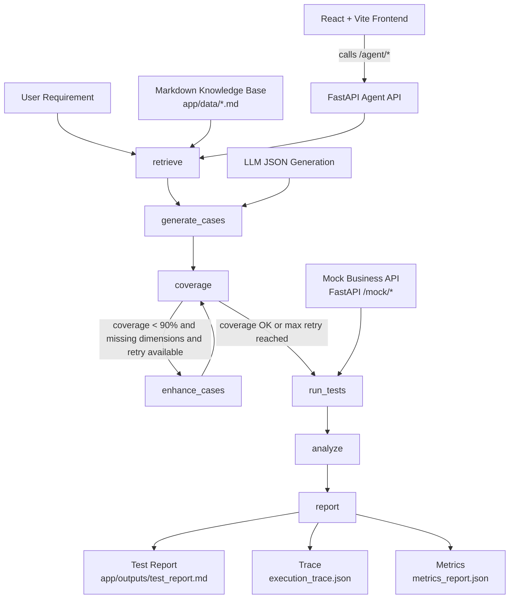

# GitHub Agent 项目求职准备报告

生成日期：2026-09-12

## 1. 当前项目真实能力

- Agent：`app/agent_graph.py` 使用 LangGraph `StateGraph`，包含 7 个业务节点和 1 条 coverage conditional edge。
- RAG：`app/rag_retriever.py` 读取 `app/data/*.md`，使用关键词/字符重合打分并返回 Top-K context，属于 Lightweight RAG。
- API：`app/mock_business_api.py` 提供 6 个 Mock Business API 和 1 个 reset 辅助接口；`app/api_server.py` 提供 Agent API。
- pytest：本次实测全仓 `23 passed, 1 warning`；其中 Mock API 测试为 8 个 testcase、22 条 assertion。
- Eval：`evals/eval_rag.py` 可运行并输出 `reports/rag_eval_results.json`；`evals/eval_structured_output.py` 当前代码已区分 API error 与 structured-output error。
- Trace：`app/tools/trace_tool.py` 记录 `timestamp`, `node_name`, `action`, `status`, `detail`。
- Metrics：`app/tools/metrics_tool.py` 统计 cases、pass rate、coverage、retry、RAG docs、bug count 等字段。
- Frontend：`frontend/` 是 React + Vite 项目，调用 `/agent/run`, `/agent/metrics`, `/agent/trace`, `/agent/report` 展示报告、指标和链路。

## 2. 当前项目量化指标

| Metric | Result | Evidence |
| --- | ---: | --- |
| Workflow Nodes | 7 | `app/agent_graph.py` 中 `graph.add_node(...)` |
| Conditional Edge | 1 | `coverage -> enhance_cases/run_tests` |
| Mock Business APIs | 6 | `app/mock_business_api.py` business routes |
| Mock Reset API | 1 | `POST /mock/reset` |
| Agent/System APIs | 5 | `/`, `/agent/run`, `/agent/trace`, `/agent/metrics`, `/agent/report` |
| Mock API pytest cases | 8 | `tests/test_mock_business_api.py` |
| Mock API assertions | 22 | `rg -n "assert\\b" tests/test_mock_business_api.py` |
| Full pytest | 23/23 passed | `python -m pytest -q` |
| pytest warnings | 1 | Starlette/anyio DeprecationWarning |
| RAG Eval questions | 20 | `python evals/eval_rag.py` |
| Answerable Top-K hit | 10/10 | `reports/rag_eval_results.json` |
| Unanswerable rejection | 0/10 | `reports/rag_eval_results.json` |
| Citation validation | 20/20 | `reports/rag_eval_results.json` |
| Frontend build | Passed | `npm run build` with elevated shell due sandbox EPERM |

## 3. README 修改内容

### 删除

- 删除旧 README 中乱码正文。
- 删除把 Promptfoo 写成核心 Agent Eval 能力的表述。
- 删除可能让人误解为向量数据库 RAG 的泛化描述。

### 修改

- 将项目描述改为可验证的质量效能测试 Agent。
- 将 pytest 数字拆成“全仓 23 tests”和“Mock API 8 tests / 22 assertions”。
- 将 RAG 明确为 Lightweight RAG。
- 将 Structured Output Eval 明确拆分为 API Reliability 与 Structured Output Quality。
- 将 Promptfoo 判断改为历史配置/保留配置。

### 新增

- README 首屏 Highlights。
- Mermaid Architecture。
- 7 个 LangGraph workflow node 说明。
- API endpoint 表格。
- Observability 字段说明。
- RAG Eval bad case。
- Demo 截图清单与保存路径。
- Known Limitations 与 Planned Future Improvements。

## 4. README 第一屏最终内容

```markdown
# Quality Agent Test Automation

这是一个面向质量效能场景的测试智能化 AI Agent：通过 LangGraph 将知识检索、测试用例生成、覆盖率分析、自动补充、Mock API 测试、缺陷分析和测试报告串联成一个可运行的工作流。

## Highlights

- 7-node LangGraph workflow: `retrieve`, `generate_cases`, `coverage`, `enhance_cases`, `run_tests`, `analyze`, `report`
- Conditional edge: coverage 不满足条件时自动进入 `enhance_cases`，再回到 `coverage`
- 6 个 Mock Business API: 创建订单、取消订单、超时取消、查询订单、查询司机、支付订单
- 8 个 Mock API pytest test cases，22 条 assertion，实测 `8/8 passed`
- 全仓 pytest 实测 `23 passed, 1 warning`
- Lightweight RAG: 读取 `app/data/*.md`，基于关键词/字符重合打分并返回 Top-K context
- Structured output generation: LLM JSON 输出解析与字段校验，失败时回退到规则生成
- Observability: execution trace 与 metrics JSON 输出
- RAG Eval: answerable Top-K expected source hit `10/10`，citation source validation `20/20`
- Structured Output Eval: 当前 eval 代码已区分 API reliability 与 structured-output quality
```

## 5. Architecture



## 6. pytest

执行命令：

```powershell
python -m pytest --collect-only -q
python -m pytest -q
```

结果：

- collected: 23
- passed: 23
- failed: 0
- warnings: 1

Mock API 测试子集：

- test cases: 8
- assertions: 22
- passed: 8/8

warning 为依赖层 Starlette/anyio `DeprecationWarning`，不是业务测试失败。

## 7. RAG Eval

执行命令：

```powershell
python evals/eval_rag.py
```

真实结果：

- total_questions: 20
- answerable_questions: 10
- topk_expected_source_hits: 10
- unanswerable_questions: 10
- correct_rejections: 0
- citation_validator_checks: 20
- citation_validator_passed: 20

Bad Case：

- 10 个 unanswerable question 都没有被拒答，说明当前关键词/字符重合检索容易把无答案问题也匹配到现有文档。
- Citation validator 当前只验证 retrieved source 是否存在于 retrieved list，不能保证回答事实正确。

README 写法建议：

- 可以写：Answerable Top-K Expected Source Hit `10/10`。
- 可以写：Citation Source Validation `20/20`。
- 必须写 limitation：unanswerable rejection still needs improvement。
- 不要写：RAG 准确率 100%。

## 8. Structured Output Eval

当前代码状态：

- `evals/eval_structured_output.py` 已实现 `classify_api_exception()`，能识别 `insufficient_balance`, `rate_limit`, `timeout`, `network_error`, `5xx`, `other_api_error`。
- `summarize()` 已把 API Reliability 与 Structured Output Quality 分开。
- `tests/test_structured_output_eval.py` 覆盖 402、429、timeout、format repair、summary denominator 等场景。

历史结果文件状态：

- `reports/structured_output_eval.json` 仍是旧统计格式。
- 历史结果显示 `total_runs=30`, `first_success=23`, `failed=7`。
- 7 个失败的 `error_reason` 均为 API 402 Insufficient Balance，不应统计为 JSON/schema 格式失败。

本次重跑状态：

- 已执行 `python evals/eval_structured_output.py`。
- 运行超过约 6 分钟无 stdout，手动中断，未得到新的 30-run 结果。
- 因此 README 不展示新的 structured-output 成功率，只说明当前 eval 代码和历史 bad case。

## 9. Demo 截图状态

- Agent Console：待截图
- Result：待截图
- Trace：待截图
- Metrics：待截图
- Report：待截图

截图目录已准备：

```text
docs/images/.gitkeep
```

建议手动截图步骤：

1. Terminal 1 启动后端：

   ```powershell
   python -m uvicorn app.api_server:app --reload
   ```

2. Terminal 2 启动前端：

   ```powershell
   cd frontend
   npm install
   npm run dev
   ```

3. 浏览器打开：

   ```text
   http://127.0.0.1:5173
   ```

4. 截图并保存：

   ```text
   docs/images/agent-console.png
   docs/images/agent-result.png
   docs/images/trace-view.png
   docs/images/metrics-view.png
   docs/images/report-view.png
   ```

说明：本次没有伪造截图。

## 10. Git 安全检查

- `.env tracked?` No。`git ls-files .env` 无输出。
- `.env ignored?` Yes。`.gitignore` 包含 `.env`。
- `.venv ignored?` Yes。`.gitignore` 包含 `.venv/`。
- API Key 泄露风险：未读取或输出真实 `.env` 内容；`.env.example` 只包含占位配置。
- `.gitignore` 已补充根目录 `dist/` 和 `build/`。

当前 git status 摘要：

```text
M requirements.txt
M README.md
M .gitignore
?? PythonProject/
?? evals/
?? reports/
?? tests/
?? docs/images/
```

说明：`requirements.txt` 在本次任务开始前已处于 modified 状态，本次未改动其内容。

## 11. PythonProject 判断

结论：建议删除或移出仓库。

理由：

- `PythonProject/` 内部包含独立 `.idea/`、`.venv/`、`__pycache__/`，更像 IDE 项目目录或旧项目副本。
- 其中只有 `jiaoben.py`、`xuexi.py`、`notebook.ipynb`，未被主项目代码引用。
- 主项目运行、测试、eval、前端构建均不依赖该目录。

处理建议：

- 不要直接删除本地文件。
- GitHub 发布前由用户确认后删除、移动到仓库外，或至少加入 `.gitignore`。

## 12. Promptfoo 判断

结论：历史配置 / 保留配置。

证据：

- 存在 `promptfooconfig.yaml`。
- 配置使用 `providers: id: echo`。
- `frontend/package.json` 不包含 promptfoo。
- `requirements.txt` 不涉及 promptfoo。
- 当前可运行 eval 位于 `evals/eval_rag.py` 和 `evals/eval_structured_output.py`。

README 建议：

- 不应把 Promptfoo 写入 Highlights 或核心 Eval 能力。
- 可以写：仓库保留早期 Promptfoo 配置，目前主要使用自定义 Python Eval。

## 13. GitHub 发布前待办

### P0 必须完成

- 修复或删除乱码历史文案，尤其是 `app/`、`frontend/` 和 `reports/` 中的中文注释/展示文案。
- 处理 `PythonProject/`：确认删除、移出或忽略。
- 再次执行 `git status`，确保 `.env`、`.venv`、`node_modules`、`dist`、`build` 没有被跟踪。
- 截取真实前端 demo 图片并保存到 `docs/images/`。
- 确认 `reports/structured_output_eval.json` 是否要用新 eval 口径重新生成。

### P1 建议完成

- 增加 `requirements-dev.txt`，将 `pytest` 与运行依赖分离。
- 给 `eval_structured_output.py` 增加单次请求 timeout，避免真实 30-run eval 长时间阻塞。
- 修复 `reports/structured_output_failure_analysis.md` 的旧乱码和过期判断。
- 在 README 中补充截图链接，截图完成后再加入图片。

### P2 后续优化

- Vector retrieval / embedding retrieval。
- Rerank。
- 更大的 RAG eval dataset。
- unanswerable rejection 规则或阈值。
- SQL persistence。
- Docker deployment。
- Structured output eval dashboard。

## 14. 简历可写内容

- 实现了基于 LangGraph 的质量效能测试 Agent，将 RAG 检索、用例生成、覆盖率分析、自动补充、接口测试、缺陷分析和报告生成串联为 7 节点工作流，并通过 conditional edge 支持覆盖不足时自动补充。
- 构建了网约车订单场景 Mock Business API，覆盖创建订单、取消订单、超时取消、查询订单、查询司机、支付订单等接口，并用 pytest 验证 8 个 Mock API 场景、22 条 assertion，实测 8/8 通过。
- 实现了轻量 RAG Eval，基于 20 条数据集评估 Top-K source hit、拒答和 citation source validation，发现 answerable source hit 为 10/10，同时暴露 unanswerable rejection 0/10 的改进点。
- 为 LLM JSON 测试用例生成设计 Structured Output Eval 和单元测试，区分 API 402/限流/超时等可靠性问题与 JSON/schema 格式质量问题，避免将 API 失败误统计为结构化输出失败。

## 15. 面试可讲亮点

1. 为什么使用 LangGraph
   - 问题：测试 Agent 不只是一次函数调用，而是有状态、有分支、有循环的流程。
   - 分析：用例生成后需要覆盖率判断，不满足时要自动补充。
   - 方案：使用 LangGraph `StateGraph` 管理 `AgentState` 和节点流转。
   - 结果：实现 7 个业务节点和 coverage conditional edge。
   - 反思：后续可以把失败恢复、人工确认和工具调用扩展为更细粒度节点。

2. 为什么使用 Conditional Edge
   - 问题：覆盖率不足时直接跑测试会导致测试集不完整。
   - 分析：coverage 节点可以输出 missing dimensions 和 coverage_rate。
   - 方案：当 coverage < 90%、存在 missing dimensions 且 retry 未达上限时，进入 enhance_cases。
   - 结果：形成 `coverage -> enhance_cases -> coverage` 的自动补充回路。
   - 反思：当前覆盖判断基于关键词，可继续升级为模型评审或规则组合。

3. pytest 如何设计
   - 问题：Mock API 必须证明能运行，而不是只展示 Agent 流程。
   - 分析：选择订单创建、取消、支付等核心业务分支做接口级测试。
   - 方案：使用 FastAPI TestClient，重置内存 Mock DB，验证响应码、状态和关键字段。
   - 结果：8 个 Mock API testcase、22 条 assertion，实测全部通过。
   - 反思：还可以补齐 order not found、invalid amount、driver not found 等错误分支测试。

4. RAG Eval 如何发现 reject 0/10
   - 问题：只看 answerable 命中会误以为 RAG 表现很好。
   - 分析：需要同时加入 unanswerable 问题，检验系统是否会拒绝无关问题。
   - 方案：设计 10 条 answerable 与 10 条 unanswerable，并统计 correct_rejections。
   - 结果：answerable Top-K source hit 为 10/10，但 unanswerable rejection 为 0/10。
   - 反思：当前 Lightweight RAG 需要增加阈值、领域过滤或拒答策略。

5. Structured Output Eval 如何区分 402 和格式失败
   - 问题：旧结果把 API 402 失败混入 structured output success rate，容易误导。
   - 分析：API 没有返回 LLM 内容时，无法判断 JSON/schema 质量。
   - 方案：新增 API error 分类，并让 structured-output denominator 只包含成功拿到 LLM 响应的 run。
   - 结果：单测覆盖 402 不重试、429/timeout 可重试、format repair、summary denominator。
   - 反思：真实 30-run eval 还需要 timeout 控制和新口径结果重跑。
